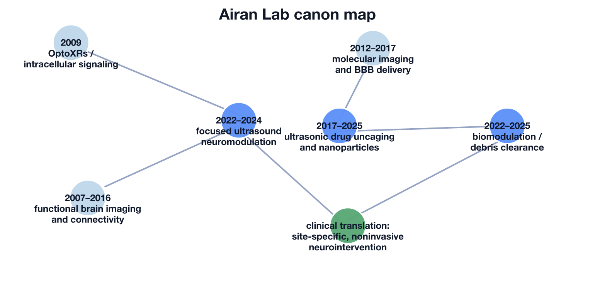

# Research Canon: Airan Lab

**PI:** Raag D. Airan — Stanford University
**Source:** https://airan-lab.stanford.edu/publications/
**Date:** 2026-04-24

`[lab-canon] lab=Airan Lab source=https://airan-lab.stanford.edu/publications/`

## In one sentence
This lab’s canon argues that the nervous system should be treated as a spatially precise therapeutic target, and that focused ultrasound paired with imaging and acoustically activatable drugs can turn noninvasive neurointervention from a stimulation concept into a programmable, clinically translatable platform.[1][2][3]

## Canon map diagram

*Original synthesis figure based on the sources below.*

## Core topics and trajectories

### Topic 1 — Focused ultrasound as precise, noninvasive neurointervention
**What problem the field inherited.** Neuroscience has long wanted a tool that can reach deep brain targets without surgery while preserving some combination of spatial precision, temporal control, and clinical realism. Electrical stimulation is invasive, pharmacology is diffuse, and early ultrasound neuromodulation was promising but mechanistically noisy: many groups could show effects, but it was unclear which parameter regimes genuinely transferred across targets and which were artifacts of sound, heat, or peripheral confounds.[2][4]

**How the trajectory bends here.** The Airan canon does not treat focused ultrasound as a single magic waveform. Instead, it turns ultrasound into an engineering space to be searched and matched to neurobiology. The newer work frames the challenge as parameter identification rather than mere proof-of-concept, showing that excitation and inhibition have distinct optima and that good waveforms can generalize better across arousal-related regions than ad hoc settings.[4] That is a subtle but important shift: the field moves from “ultrasound can do something” to “ultrasound can be tuned into a reproducible intervention class.”

**Relationship to prior art.** Relative to earlier neuromodulation literature, this canon is more translational and less device-demonstrative. Earlier studies often established possibility at a single target; here the recurring question is whether a protocol remains focal, behaviorally meaningful, and compatible with eventual human use.[2][4] The lab’s stance is that noninvasive control is credible only if targeting, waveform choice, and safety margins are all treated as first-class design variables.

### Topic 2 — Ultrasonic drug uncaging and acoustically activatable nanomedicine
**What problem the field inherited.** Many brain disorders require chemistry, not just stimulation: the therapeutic effect depends on what molecule reaches what tissue and when. But systemic delivery is spatially blunt, while BBB opening and implanted delivery devices can add risk or lose temporal precision. The field therefore needed a way to deliver pharmacology with the addressability of a physical device.[1][5][6]

**How the trajectory bends here.** This is the signature Airan move. Rather than using ultrasound only to push or stimulate tissue, the lab uses it as a remote trigger for local drug release. The 2017 and 2018 papers establish the core idea: circulating nanoparticles can release propofol only where sonication occurs, enabling focal neuromodulation without requiring frank BBB opening.[5][6] The later liposome work sharpens the translational thesis by replacing more bespoke carrier logic with formulations built from more familiar pharmaceutical ingredients, broadening the drug repertoire and lowering the “interesting but impractical” objection.[7]

**Relationship to prior art.** Prior ultrasound-mediated delivery often leaned on cavitation, heating, or BBB opening. The distinctive contrast here is pharmacologic addressability: the intervention is neither systemic drug alone nor direct ultrasound alone, but a hybrid in which ultrasound selects the anatomical site and the formulation selects the biochemical action.[5][6][7] That makes this canon unusually strong at linking nanomedicine to circuit intervention rather than treating them as separate literatures.

### Topic 3 — Biomodulation, glymphatic/meningeal clearance, and neuroimmune therapy
**What problem the field inherited.** A large fraction of neurologic injury is not just failed signaling but failed clearance: blood products, inflammatory debris, and toxic byproducts persist in tissue and worsen outcome. Existing strategies to enhance clearance have often depended on systemic drugs, invasive administration, or indirect correlational claims about glymphatic function.[2][8]

**How the trajectory bends here.** The recent Airan work expands ultrasound beyond stimulation or delivery into a disease-modifying clearance tool. The key claim is not simply that ultrasound moves fluid, but that low-intensity protocols can accelerate removal of pathologic material from cerebrospinal fluid and interstitium, shift microglial and astrocytic states, and improve outcomes in hemorrhagic injury models.[8] This is a conceptual broadening of the lab’s canon: ultrasound becomes a way to manipulate tissue state and waste handling, not only neuronal excitability.

**Relationship to prior art.** In contrast to much of the neuromodulation field, this trajectory is less about evoking an acute behavioral response and more about changing recovery dynamics after injury. It also differs from classic drug-delivery work because the therapeutic payload is partly the physical intervention itself. The lab’s contribution is to connect meningeal lymphatic thinking, mechanosensitive biology, and ultrasound engineering into a single therapeutic narrative.[2][8] If the earlier canon was “right drug, right place, right time,” this branch adds “right tissue state, right clearance regime.”

### Topic 4 — Imaging, connectivity, and mechanistic psychiatry as readouts of intervention
**What problem the field inherited.** Even when an intervention reaches the brain, the field still struggles to tell whether it changed a local site only, altered a connected network, or engaged the mechanism people think it did. That problem is especially acute in psychiatry, where behavioral endpoints are coarse and competing mechanistic stories can survive for years.[2][3][6][9]

**How the trajectory bends here.** The Airan canon uses imaging not just to look at the brain but to adjudicate intervention logic. Earlier work on functional imaging, resting-state variability, and presurgical mapping built a repertoire for reading network organization and its distortions.[1][3] That background feeds directly into later ultrasonic drug-uncaging studies, which ask how focal pharmacology propagates through whole-brain networks rather than stopping at the sonicated voxel.[6] The ketamine program extends the same logic: functional ultrasound and connectivity analysis are used to test whether opioid signaling, sex, and region-targeted exposure reshape ketamine’s effects in ways standard pharmacology would blur.[3][9]

**Relationship to prior art.** The contrastive feature here is that imaging is not merely confirmatory. It is part of the causal argument. This places the lab between classic systems neuroscience and intervention engineering: interventions are judged by the network patterns they induce, and network readouts are used to decide whether a mechanistic claim is even plausible.[3][6][9] That combination gives the canon a distinctly translational-systems flavor rather than a purely biophysical one.

## Papers ranked by originality

### 1. Temporally precise in vivo control of intracellular signalling (2009)
**Source:** https://pubmed.ncbi.nlm.nih.gov/19295515/
This paper is the deepest intellectual root of the canon because it targeted intracellular GPCR signaling, not just spike output, and showed that temporally precise biochemical control could alter reward-related behavior.[10] Its contrastive difference from much early optogenetics is the level of intervention: it asked what happens when one controls signaling pathways themselves rather than merely forcing neurons to fire.

### 2. Noninvasive Targeted Transcranial Neuromodulation via Focused Ultrasound Gated Drug Release from Nanoemulsions (2017)
**Source:** https://pubmed.ncbi.nlm.nih.gov/28094959/
This is the platform-defining paper for the modern lab canon. Its contrastive difference is that ultrasound is used as a spatial trigger for local pharmacology, rather than as a direct stimulator or a BBB-opening adjunct, enabling focal neuromodulation without overt parenchymal damage or blood-brain barrier opening in the reported rat experiments.[5]

### 3. Noninvasive Ultrasonic Drug Uncaging Maps Whole-Brain Functional Networks (2018)
**Source:** https://pubmed.ncbi.nlm.nih.gov/30408444/
This work advances the 2017 platform from local effect to network assay. Its contrastive difference is that focal uncaging is treated as a way to map downstream functional connectivity signatures of a pharmacologic perturbation, not just to show that release occurred at the target.[6]

### 4. Clearance of intracranial debris by ultrasound reduces inflammation and improves outcomes in hemorrhagic stroke models (2025)
**Source:** https://pubmed.ncbi.nlm.nih.gov/41214344/
This paper is the strongest evidence that the lab’s ultrasound program is not limited to neuromodulation in the narrow sense. Its contrastive difference is that the intervention acts through clearance and neuroimmune state-shifting, positioning ultrasound as a therapeutic regulator of brain debris handling rather than only a stimulator or delivery gate.[8]

### 5. Acoustically activatable liposomes as a translational nanotechnology for site-targeted drug delivery and noninvasive neuromodulation (2025)
**Source:** https://pubmed.ncbi.nlm.nih.gov/40826187/
This paper matters because it turns the uncaging idea from a clever nanomaterials result into a more explicitly translational formulation strategy. Its contrastive difference is the use of more clinically familiar liposomal design logic and multi-drug versatility, which narrows the gap between proof-of-concept sonopharmacology and deployable therapeutic platforms.[7]

## Publication reach and topic stance

- **Noninvasive nervous-system control:** focused ultrasound should become a precision intervention modality, but only if its parameters are explicitly optimized rather than treated as generic stimulation settings.[2][4]
- **Ultrasonic drug uncaging:** spatially targeted pharmacology is more powerful than either diffuse systemic drug delivery or ultrasound-only stimulation when the therapeutic question is chemically specific.[1][5][6][7]
- **Biomodulation and clearance:** ultrasound can be therapeutic by changing fluid handling, glial state, and debris clearance, not just by changing neural firing.[2][8]
- **Imaging-led mechanistic psychiatry:** network imaging is not a side measurement; it is the main way to decide whether a brain intervention is mechanistically coherent.[3][6][9]

## To go deeper
Run `/summarize <url>` on any paper above for a full levelled read with hinges and Michelin-table questions.

## Coverage gaps
- I manually counted roughly 38 reachable DOI/PubMed-bearing entries on the official publications page across five topic buckets, which is strong enough for a canon map.[1]
- Stanford Profiles adds recent abstracts and affiliation context, but it mixes full papers, perspectives, and conference items, so not every entry there is equally canon-defining.[3]
- Some early papers predate the Stanford lab as an institution and are better read as PI intellectual antecedents than as products of the current Stanford group.[1][10]
- Verification note for the URLs used here was saved locally at `notes/airan-verification.md`.

## Sources
[1] Airan Lab publications: https://airan-lab.stanford.edu/publications/
[2] Airan Lab research page: https://airan-lab.stanford.edu/research/
[3] Stanford Profiles — Raag Airan: https://profiles.stanford.edu/raag-airan
[4] Murphy KR et al. *Optimized ultrasound neuromodulation for non-invasive control of behavior and physiology* (2024): https://pubmed.ncbi.nlm.nih.gov/39079529/
[5] Airan RD et al. *Noninvasive Targeted Transcranial Neuromodulation via Focused Ultrasound Gated Drug Release from Nanoemulsions* (2017): https://pubmed.ncbi.nlm.nih.gov/28094959/
[6] Wang JB et al. *Noninvasive Ultrasonic Drug Uncaging Maps Whole-Brain Functional Networks* (2018): https://pubmed.ncbi.nlm.nih.gov/30408444/
[7] Purohit MP et al. *Acoustically activatable liposomes as a translational nanotechnology for site-targeted drug delivery and noninvasive neuromodulation* (2025): https://pubmed.ncbi.nlm.nih.gov/40826187/
[8] Azadian MM et al. *Clearance of intracranial debris by ultrasound reduces inflammation and improves outcomes in hemorrhagic stroke models* (2025): https://pubmed.ncbi.nlm.nih.gov/41214344/
[9] Di Ianni T et al. *Sex dependence of opioid-mediated responses to subanesthetic ketamine in rats* (2024): https://pubmed.ncbi.nlm.nih.gov/38291050/
[10] Airan RD et al. *Temporally precise in vivo control of intracellular signalling* (2009): https://pubmed.ncbi.nlm.nih.gov/19295515/
