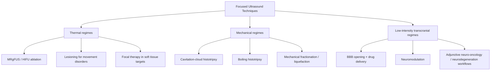

# State of the Art Focused Ultrasound Techniques

## Executive Summary
Focused ultrasound (FUS) is better understood as a family of acoustic interventions that operate in different physical regimes rather than as a single technique.[1,10,16] The most clinically mature branch in routine use is image-guided thermal ablation, especially MR-guided focused ultrasound (MRgFUS) for uterine fibroids and for lesioning in medication-refractory essential tremor.[1,6,7] A second branch, mechanical ablation via histotripsy, has moved from preclinical work to early clinical translation in liver tumors, with first-in-human, pivotal single-arm, and early post-clearance safety data now available for cavitation-cloud histotripsy.[10,12,13,14] A third branch, low-intensity transcranial focused ultrasound, includes blood-brain barrier (BBB) opening, drug delivery, and neuromodulation; the strongest current human evidence in this group is for repeatable procedural target engagement and short-term safety rather than durable disease-level efficacy.[16,17,18,19,20,21,22,23]

Across technique families, the reviewed literature suggests that the main frontier is no longer basic feasibility alone, but reliable anatomy-aware control: delivering energy through bone, fat, gas, and vessels; monitoring the intended biological effect in real time; and showing durable clinical benefit beyond technical success.[2,3,4,5,10,11,15,17,22,23]

## Scope and Method
This review emphasizes literature from 2018–2025, with older landmark papers included when they define the modern field.

I prioritized:
- review papers that synthesize the field,
- pivotal or landmark primary studies,
- guideline-style technical papers for treatment planning and monitoring,
- official web sources only for current regulatory or field-status context.

The review is organized by physical regime and clinical maturity rather than by organ alone, because the most important distinctions in FUS depend on whether tissue effects are mainly thermal, mechanical/cavitation-mediated, or low-intensity modulatory/permeabilizing.[10,16]

## Taxonomy of Focused Ultrasound Techniques
Recent reviews consistently separate major FUS applications into thermal ablation, mechanical cavitation-mediated ablation, and low-intensity transcranial uses such as BBB opening and neuromodulation.[1,10,16]

### Practical taxonomy
1. Thermal ablation / HIFU / MRgFUS  
   High acoustic intensities deposit heat at the focus to create coagulative necrosis or stereotactic lesions.[1,2,16]
2. Mechanical ablation / histotripsy  
   Short, high-pressure pulses use cavitation clouds or boiling-mediated bubble dynamics to mechanically fractionate tissue rather than relying primarily on thermal coagulation.[10,11]
3. Low-intensity transcranial techniques  
   Lower-intensity exposures are used either to open the BBB transiently, usually with microbubbles, or to modulate neural circuits without intended ablation.[16,17,22,23]

## Technique Family 1: Thermal Ablation and HIFU
### What looks mature
Thermal ablation is the most established FUS modality in routine clinical practice among the technique families reviewed here.[1,2] The most mature workflows in this literature set are uterine fibroid treatment, where MR thermometry and post-treatment nonperfused volume assessment became foundational early, and transcranial MRgFUS thalamotomy, where randomized sham-controlled evidence established benefit for medication-refractory essential tremor.[6,7] Thermal FUS is also advancing in prostate focal therapy, where a multicenter prospective single-arm phase 2b study reported absence of grade-group-2-or-higher cancer in the treated area at 24 months in 78 of 89 evaluable patients, with low severe toxicity; however, this is a treated-zone biopsy outcome rather than definitive patient-level comparative cancer control, so longer-term and comparative questions remain open.[2,8]

### What enables maturity
The common enabling stack across mature thermal workflows is accurate treatment planning, high-quality image guidance, intraprocedural thermal monitoring, and post-ablation endpoint assessment.[2,3,5] MRI remains the dominant modality because it combines soft-tissue visualization with thermometry and post-treatment assessment.[2,3,5] Cross-cutting technical papers emphasize that the important question is now how to deliver and verify thermal dose robustly in heterogeneous tissue, not whether ultrasound can heat tissue at all.[2,3,4,5]

### Main bottlenecks
The main unresolved problems in thermal FUS are heterogeneous anatomy, especially prefocal fat, bone, vessels, and tissue interfaces; thermometry limits, especially outside water-rich tissue and under motion or susceptibility artifacts; endpoint uncertainty, because thermal dose contours do not always perfectly match the eventual ablation zone; and uneven evidence depth outside a few mature indications.[2,3,4,5,6,8] A newer but still early thread is the use of noncontrast MRI readouts such as diffusion-weighted imaging for immediate endpoint verification; one small prostate study found better agreement with postcontrast nonperfused volume than thermal dose contours alone, but that evidence is still limited.[3,9]

## Technique Family 2: Histotripsy and Other Mechanical Ablation Regimes
### What looks state of the art
Histotripsy is the clearest example of a nonthermal FUS technique reaching meaningful clinical translation in this review set.[10,12,13,14] The current literature supports a split view: cavitation-cloud histotripsy is clinically ahead, especially in liver tumors, whereas boiling histotripsy remains technologically advanced but mostly preclinical.[10,11,12,13,14,15] Cavitation-cloud histotripsy already has first-in-human feasibility data, a pivotal single-arm liver trial, and an early multicenter post-clearance safety series.[12,13,14] This supports strong translational momentum and early post-clearance clinical use in liver, but not yet broad comparative efficacy claims across organs.[12,13,14] By contrast, boiling histotripsy shows strong progress in phased-array design, steering, and Doppler-based monitoring, but the evidence base cited here is still preclinical.[10,11,15]

### Why histotripsy is attractive
Compared with thermal HIFU, reviews consistently describe sharper mechanical lesion boundaries, less dependence on thermal diffusion and heat-sink effects, relative sparing of some connective structures such as vessels or ducts, and ultrasound-visible cavitation activity that can support real-time treatment monitoring.[10,11]

### Main bottlenecks
The reviewed histotripsy literature is consistent that the main bottlenecks are practical and translational rather than conceptual: acoustic access through ribs, skull, or bowel gas; motion management in abdominal targets; treatment speed, especially for volumetric boiling histotripsy; quantitative real-time endpoints; and mature comparative efficacy data versus established local therapies.[10,11,12,13,15] Passive cavitation imaging and Doppler-based monitoring are promising, but this review does not support calling them clinically standardized yet.[11,15]

## Technique Family 3: Brain Applications Beyond Thermal Lesioning
### BBB opening and drug delivery
BBB opening appears to be the strongest low-intensity transcranial FUS use case in this literature from a technical-translation perspective, mainly because repeated human studies show imaging-confirmed target engagement.[16,17,18] Human studies in Alzheimer’s disease and glioma show that MRI-confirmed BBB opening can be produced safely and reversibly in small cohorts, including 5 patients in the 2018 Alzheimer’s phase I study, 5 glioma patients in the 2019 feasibility study, and 10 participants completing 30 treatments in the 2022 Alzheimer’s follow-up study.[19,20,21] The more defensible conclusion is procedural maturity of target engagement and short-term safety rather than proven disease-level efficacy.[17,18,19,20,21] The field has repeatedly shown that BBB opening can be produced and closed on schedule, but robust, reproducible clinical benefit across indications remains unproven in the sources reviewed here. In particular, imaging or biomarker changes in small open-label Alzheimer’s cohorts should not be read as established disease modification.[17,18,19,20,21]

### Neuromodulation
Low-intensity transcranial FUS neuromodulation is promising because it can reach deep targets noninvasively.[16,22,23] The human literature now includes sham-controlled evidence in pain and a randomized, double-blind, sham-controlled clinical trial in major depressive disorder.[24,25] Even so, compared with BBB opening, neuromodulation remains methodologically less settled in the reviewed literature, with ongoing disagreement about optimal parameters, mechanism, and the importance of possible auditory or peripheral confounds.[22,23]

### Main bottlenecks
Recurring technical and translational problems across low-intensity transcranial studies are skull-aware dosimetry and aberration correction, protocol heterogeneity across pressure, frequency, duty cycle, and exposure duration, limited real-time feedback and safety monitoring, mechanistic ambiguity in neuromodulation, and a shortage of large efficacy trials with durable clinical endpoints.[17,18,22,23]

## Imaging, Targeting, Monitoring, and Control
Across families, the state of the art increasingly depends on the monitoring stack:

- MRI thermometry remains central for thermal MRgFUS, especially in brain and many soft-tissue workflows.[2,5]
- Post-treatment MRI, including nonperfused volume assessment and diffusion-weighted imaging, remains important because intraprocedural dose maps are imperfect surrogates for final effect.[3,6,9]
- Ultrasound-based cavitation monitoring is central for histotripsy and BBB-opening workflows, but robust closed-loop clinical control remains incomplete.[10,11,15,17]
- Patient-specific compensation for skull, bone, gas, and tissue heterogeneity is a cross-family requirement.[2,4,17,23]

A unifying observation from this literature set is that progress in FUS is increasingly driven by control quality and measurement quality, not only by raw acoustic power.[2,5,10,17]

## Clinical Maturity Snapshot
| Technique family | Current maturity | Strongest evidence in this review | Main limiting factor |
|---|---|---|---|
| Thermal ablation / MRgFUS | Mature in selected indications | Randomized ET thalamotomy [7]; long-standing uterine fibroid thermometry workflows [6]; multicenter prostate focal therapy [8] | Anatomy-aware dosimetry and endpoint verification [2,3,4,5,9] |
| Cavitation-cloud histotripsy | Early post-clearance clinical use in liver | THERESA first-in-human liver study [12]; #HOPE4LIVER pivotal single-arm trial [13]; early multicenter safety series [14] | Evidence is still largely non-comparative; broader organ access and long-term comparative efficacy remain open [10,13,14] |
| Boiling histotripsy | Advanced preclinical | Histotripsy review [10]; bubble-physics review [11]; Doppler monitoring study [15] | Clinical translation, speed, and standardized control [10,11,15] |
| BBB opening / drug delivery | Early clinical for procedural target engagement; efficacy still unproven | Alzheimer’s and glioma BBB-opening studies [19,20,21] | Standardization and proof of clinical benefit [17,18,21] |
| Neuromodulation | Exploratory to early clinical | Clinical neuromodulation reviews [22,23]; sham-controlled pain study [24]; randomized MDD trial [25] | Mechanism, parameter standardization, and larger trials [22,23] |

## Quantitative Milestones
Selected source-linked textual milestones:

- A foundational uterine fibroid MRgFUS thermometry study evaluated 64 fibroids in 50 women.[6]
- The pivotal randomized sham-controlled essential tremor thalamotomy trial enrolled 76 patients.[7]
- The multicenter phase 2b prostate focal-therapy study enrolled 101 men, with 89 evaluable at 24 months for the reported treated-area outcome.[8]
- The THERESA first-in-human liver histotripsy study treated 8 patients with 11 tumors.[12]
- The #HOPE4LIVER pivotal liver histotripsy trial treated 44 participants with 49 tumors.[13]
- A phase I Alzheimer’s BBB-opening study enrolled 5 patients.[19]
- A later Alzheimer’s BBB-opening study reported 10 participants completing 30 treatments across two institutions.[21]
- A double-blind, sham-controlled thalamic neuromodulation study enrolled 19 healthy participants.[24]

Interpretation: these selected landmarks suggest that thermal ablation reached larger human cohorts earlier, histotripsy entered human liver studies later but accelerated quickly, and BBB-opening and neuromodulation studies remain comparatively small. This is a descriptive summary of selected landmark studies in this review, not a systematic meta-analysis.[6,7,8,12,13,19,21,24]

## Cross-study Themes in the Reviewed Literature
Across the literature reviewed, the following themes recur:
1. Focused ultrasound is a platform, not a single treatment. Different acoustic regimes create fundamentally different biological effects.[1,10,16]
2. Thermal MRgFUS is the most clinically mature branch. Its best-established use cases are concentrated in selected indications rather than broadly across all organs.[1,2,6,7]
3. Histotripsy is the main nonthermal breakthrough. Liver is the clearest current clinical beachhead.[10,12,13,14]
4. BBB opening appears technically ahead of neuromodulation in human target-engagement evidence. That comparison should still be read as a synthesis of the reviewed studies, not as a settled field-wide ranking.[17,19,20,21,22,23]
5. Monitoring and control are a major frontier. Better delivery through heterogeneous anatomy and better effect verification are recurrent needs across families.[2,4,5,10,15,17]

## Disagreements and Uncertainties
1. How close neuromodulation is to clinical readiness. Reviews agree it is promising, but they differ in tone because the evidence base is still small and heterogeneous.[22,23]
2. How broadly to generalize histotripsy success beyond liver. Current clinical evidence is strongest in relatively small liver lesions, so broader claims would be premature.[12,13,14]
3. How much BBB opening alone can modify disease biology. Some Alzheimer’s studies report imaging or biomarker changes, but effect variability and small samples limit confidence.[19,21]
4. Which monitoring modality should dominate next-generation workflows. Diffusion-weighted MRI, thermal dosimetry, passive cavitation methods, and Doppler methods all show promise, but no universal endpoint has emerged.[3,5,9,11,15]

## Open Questions
1. What is the best closed-loop control framework for each regime: thermal dose, DWI, cavitation emissions, Doppler motion signatures, or multimodal fusion?[3,5,9,11,15]
2. Can histotripsy show durable local control or survival benefit versus radiofrequency ablation, microwave ablation, or stereotactic radiotherapy in comparative trials?[12,13,14]
3. Can BBB-opening protocols be standardized enough to support reproducible drug-delivery gains across centers?[17,18]
4. For neuromodulation, what fraction of observed effects are direct neural modulation versus auditory or peripheral co-stimulation?[22,23]
5. Which anatomical targets remain fundamentally difficult because of skull, rib, or bowel-gas constraints, and which can be solved by better planning and hardware?[2,4,10]

## Recommended Next Experiments and Follow-up Reading
### Next experiments
1. Closed-loop monitoring comparisons: compare thermal dose, DWI, cavitation imaging, and Doppler-derived metrics against final tissue effect in the same workflow.[3,5,9,11,15]
2. Comparative clinical trials for histotripsy: especially in liver and, when feasible, kidney or pancreas versus established local therapies.[12,13,14]
3. Protocol-standardization studies for BBB opening: harmonize pressure, microbubble, imaging, and safety reporting across centers.[17,18]
4. Mechanism-focused neuromodulation studies: include auditory-control conditions, skull-aware dosimetry, and preregistered parameter sweeps.[22,23]

### Follow-up reading shortlist
- Payne et al., *AAPM Task Group 241* (2021).[2]
- Xu et al., *Histotripsy: A Method for Mechanical Tissue Ablation with Ultrasound* (2024).[10]
- Meng et al., *Applications of focused ultrasound in the brain* (2021).[16]
- Mattay et al., *MR Thermometry during Transcranial MR Imaging–Guided Focused Ultrasound Procedures* (2024).[5]
- Gandhi et al., systematic review of BBB-disruption protocols (2022).[17]

## Limitations of This Review
- This is a targeted literature review, not a registered systematic review or meta-analysis.
- The quantitative-milestones section is based on selected landmark studies from this review, not exhaustive trial enumeration.[6,7,8,12,13,19,21,24]
- Some application areas, such as pancreatic thermal HIFU, immunologic combination strategies, and vendor-specific treatment-planning pipelines, were not reviewed in equal depth.
- Core claims in this review rely primarily on papers rather than field-summary web pages.[1,2,10,16]

## Sources
1. Lee EJ, et al. *Magnetic Resonance-Guided Focused Ultrasound: Current Status and Future Perspectives in Thermal Ablation and Blood-Brain Barrier Opening* (2019). https://pubmed.ncbi.nlm.nih.gov/30630292/
2. Payne A, et al. *AAPM Task Group 241: A medical physicist's guide to MRI-guided focused ultrasound body systems* (2021). https://pubmed.ncbi.nlm.nih.gov/34224149/
3. Fite BZ, Ferrara KW. *A Review of Imaging Methods to Assess Ultrasound-Mediated Ablation* (2022). https://pmc.ncbi.nlm.nih.gov/articles/PMC9364780/
4. deSouza NM, et al. *Tissue specific considerations in implementing high intensity focussed ultrasound under magnetic resonance imaging guidance* (2022). https://pmc.ncbi.nlm.nih.gov/articles/PMC9663991/
5. Mattay RR, et al. *MR Thermometry during Transcranial MR Imaging–Guided Focused Ultrasound Procedures: A Review* (2024). https://www.ajnr.org/content/45/1/1
6. McDannold N, et al. *Uterine leiomyomas: MR imaging-based thermometry and thermal dosimetry during focused ultrasound thermal ablation* (2006). https://pubmed.ncbi.nlm.nih.gov/16793983/
7. Elias WJ, et al. *A Randomized Trial of Focused Ultrasound Thalamotomy for Essential Tremor* (2016). https://pubmed.ncbi.nlm.nih.gov/27557301/
8. Ehdaie B, et al. *MRI-guided focused ultrasound focal therapy for patients with intermediate-risk prostate cancer: a phase 2b, multicentre study* (2022). https://pubmed.ncbi.nlm.nih.gov/35714666/
9. Bitton RR, et al. *Intraprocedural Diffusion-weighted Imaging for Predicting Ablation Zone during MRI-guided Focused Ultrasound of Prostate Cancer* (2024). https://pubmed.ncbi.nlm.nih.gov/39212524/
10. Xu Z, Khokhlova TD, Cho CS, Khokhlova VA. *Histotripsy: A Method for Mechanical Tissue Ablation with Ultrasound* (2024). https://www.annualreviews.org/content/journals/10.1146/annurev-bioeng-073123-022334
11. Bader KB, Vlaisavljevich E, Maxwell AD. *For Whom the Bubble Grows: Physical Principles of Bubble Nucleation and Dynamics in Histotripsy Ultrasound Therapy* (2019). https://pubmed.ncbi.nlm.nih.gov/30922619/
12. Vidal-Jové J, et al. *First-in-man histotripsy of hepatic tumors: the THERESA trial, a feasibility study* (2022). https://pubmed.ncbi.nlm.nih.gov/36002243/
13. Mendiratta-Lala M, et al. *The #HOPE4LIVER Single-Arm Pivotal Trial for Histotripsy of Primary and Metastatic Liver Tumors* (2024). https://pubmed.ncbi.nlm.nih.gov/39225612/
14. Wehrle CJ, et al. *The first international experience with histotripsy: a safety analysis of 230 cases* (2025). https://pubmed.ncbi.nlm.nih.gov/39978577/
15. Song M, et al. *Quantitative Assessment of Boiling Histotripsy Progression Based on Color Doppler Measurements* (2022). https://pmc.ncbi.nlm.nih.gov/articles/PMC9741864/
16. Meng Y, et al. *Applications of focused ultrasound in the brain: from thermoablation to drug delivery* (2021). https://doi.org/10.1038/s41582-020-00418-z
17. Gandhi K, et al. *Ultrasound-Mediated Blood-Brain Barrier Disruption for Drug Delivery: A Systematic Review of Protocols, Efficacy, and Safety Outcomes from Preclinical and Clinical Studies* (2022). https://pubmed.ncbi.nlm.nih.gov/35456667/
18. Brighi C, et al. *Translation of focused ultrasound for blood-brain barrier opening in glioma* (2022). https://pubmed.ncbi.nlm.nih.gov/35337938/
19. Lipsman N, et al. *Blood-brain barrier opening in Alzheimer's disease using MR-guided focused ultrasound* (2018). https://doi.org/10.1038/s41467-018-04529-6
20. Mainprize T, et al. *Blood-Brain Barrier Opening in Primary Brain Tumors with Non-invasive MR-Guided Focused Ultrasound: A Clinical Safety and Feasibility Study* (2019). https://doi.org/10.1038/s41598-018-36340-0
21. Rezai AR, et al. *Focused ultrasound-mediated blood-brain barrier opening in Alzheimer's disease: long-term safety, imaging, and cognitive outcomes* (2022). https://pubmed.ncbi.nlm.nih.gov/36334289/
22. Matt E, et al. *Current state of clinical ultrasound neuromodulation* (2024). https://doi.org/10.3389/fnins.2024.1420255
23. Shi Y, et al. *A panoramic review of transcranial focused ultrasound neuromodulation: from basic research to clinical applications* (2025). https://doi.org/10.1186/s12984-025-01753-2
24. Badran BW, et al. *Sonication of the anterior thalamus with MRI-Guided transcranial focused ultrasound (tFUS) alters pain thresholds in healthy adults: A double-blind, sham-controlled study* (2020). https://pmc.ncbi.nlm.nih.gov/articles/PMC7888561/
25. Oh J, et al. *Effect of Low-Intensity Transcranial Focused Ultrasound Stimulation in Patients With Major Depressive Disorder: A Randomized, Double-Blind, Sham-Controlled Clinical Trial* (2024). https://pmc.ncbi.nlm.nih.gov/articles/PMC11321877/
