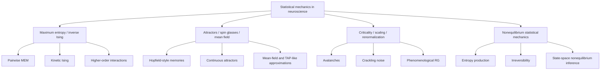

# Statistical Mechanics Techniques in Neuroscience

## Executive Summary
Statistical mechanics is an established methodological language in neuroscience, but it is used in several partly overlapping ways rather than as one uniform program.[1][14][24] The literature reviewed here separates into four main programs: **maximum-entropy and inverse-Ising models for neural population activity**, **attractor and spin-glass-inspired network theory for memory and computation**, **criticality, scaling, and renormalization approaches for collective brain dynamics**, and a newer **nonequilibrium/statistical-thermodynamics program** focused on irreversibility and entropy flow.[1][13][14][15][24][28]

Within this review set, **pairwise maximum-entropy / inverse-Ising methods** and **mean-field or attractor-network theory** are among the more methodologically developed data-facing approaches.[1][12][15][17] The most debated area is **brain criticality**: recent reviews and critiques argue against a simple consensus that the brain sits exactly at a critical point, and instead discuss near-critical, reverberating, or quasicritical alternatives.[25][27][32][36] A fast-moving newer frontier is **nonequilibrium statistical mechanics**, where recent work estimates entropy production, irreversibility, or time-varying entropy flow from neural data.[13][28]

A short synthesis is:
- **Best-established use in this review set:** maximum-entropy models as interpretable population baselines rather than universal explanations.[1][11][12]
- **A comparatively well-validated theory tradition in this review set:** attractor and mean-field models for memory, navigation, and persistent activity.[15][17][21][22]
- **Most debated claim:** whether critical-like statistics imply a deep organizing principle or a descriptive pattern sensitive to coarse-graining, subsampling, and model choice.[25][27][32][36]
- **One promising recent direction:** nonstationary and nonequilibrium statistical mechanics of neural dynamics.[13][28]

## Scope and Method
This review emphasizes literature from **2015–2026**, while including older landmark papers when they remain foundational for current usage.[1][4][24][28] The aim is methodological rather than encyclopedic: to identify the main statistical-mechanics techniques used in neuroscience, where they succeed, where they fail, and where the main live controversies remain.[1][15][25]

The review draws primarily on review articles, landmark theory papers, and representative primary applications spanning neural population coding, recurrent network theory and attractor dynamics, hippocampal and grid-cell memory/navigation models, criticality and avalanche analysis, renormalization/coarse-graining, and nonequilibrium neural dynamics.[1][6][15][22][24][25][28][33]

## Taxonomy of Statistical-Mechanics Techniques in Neuroscience

## Technique Family 1: Maximum Entropy, Inverse Ising, and Neural Population Models
### Core idea
Maximum-entropy models describe neural population activity using the least-structured probability distribution consistent with observed low-order statistics; in practice, the most common model is the pairwise maximum-entropy or Ising model, which matches firing rates and pairwise correlations.[1][4]

### Why this technique became influential
The classic motivation came from Schneidman et al., who showed that even weak pairwise correlations in retinal populations can imply strongly collective network states.[4] That result made statistical mechanics central to neural coding because it suggested that low-order interactions can strongly constrain large-scale population behavior.[4] Later work extended this line of analysis beyond retina to hippocampus, cortex, and whole-brain fMRI.[6][10][11][12]

### What the modern literature says
The field now treats pairwise maximum-entropy models less as universal explanations and more as **strong baselines**.[1][2][12] They often work well for small to moderate neural populations and in some sensory systems, but their quality can degrade for larger populations, heterogeneous cortex, or settings where higher-order interactions and nonstationarity matter.[7][11][12][13]

Three themes recur in the recent literature:
1. **Pairwise structure is often informative but not always sufficient.** In the sources reviewed here, pairwise models explain a large fraction of activity structure in some sensory populations, while at least one prominent executive-cortex study found stronger evidence for higher-order interactions.[11][12]
2. **Static equilibrium models have scale limits.** Larger populations, larger bins, and higher firing rates can degrade fit quality, and some pairwise fits can show pathological behavior such as unrealistic bimodality or non-ergodicity.[7][12]
3. **Dynamic and nonequilibrium extensions are increasingly important.** Continuous-time inverse Ising, kinetic Ising, and state-space variants aim to capture temporal couplings and nonstationary entropy flow instead of only static snapshots.[9][13]

### What this technique is good for
- interpretable null-plus models of population activity,[1][12]
- quantifying collective structure beyond independence,[4][6]
- benchmarking whether pairwise statistics are enough,[11][12]
- coarse energy-landscape descriptions of neural states, including whole-brain fMRI applications.[10]

### Main limitations
- inferred couplings should not be read automatically as anatomical connectivity,[8][9]
- model quality degrades with hidden units, finite sampling, and nonstationarity.[7][12][13]
- pairwise models can become unrealistic or non-ergodic at larger scales.[7]
- success is strongly area- and assay-dependent.[6][10][11][12]

## Technique Family 2: Attractors, Spin Glasses, and Mean-Field Theory
### Core idea
A second major tradition uses tools from statistical mechanics to analyze recurrent neural networks that store memories, integrate information over time, or support low-dimensional collective manifolds.[15][17] This includes Hopfield-style autoassociative memory, continuous attractor neural networks, spin-glass-inspired storage analyses, and mean-field reductions of spiking populations.[3][16][17]

### Why this tradition matters
This is a relatively biologically grounded statistical-mechanics tradition because attractor and mean-field ideas now connect directly to experiments on persistent activity in frontal cortex, head-direction and grid-cell systems, hippocampal spatial maps, and memory retrieval dynamics.[15][21][22][23]

### What the modern literature says
Recent work has shifted from idealized capacity calculations toward more biologically constrained questions, including how memory structure could be read from connectivity, how online learning and forgetting alter retrieval dynamics, how continuous attractors behave under realistic storage loads, and how hippocampal systems balance example-specific memory with concept-level generalization.[16][18][19][23]

The experimental connection has also become stronger. Discrete attractor dynamics are supported by perturbation experiments in mouse frontal cortex,[21] while large-scale grid-cell recordings revealed toroidal population structure that strongly supports continuous-attractor ideas.[22] Together with review syntheses of head-direction, grid, and working-memory systems, these results make attractor and integrator models unusually well supported biological examples within the sources sampled here.[15][21][22]

### Where spin-glass methods still matter
Replica methods, interpolation techniques, and related spin-glass tools remain useful for:
- phase diagrams of memory models,[16]
- storage/load calculations,[16]
- understanding frustration and glassy regimes,[3][20]
- Bayesian reconstruction problems on network connectivity.[18]

### Main limitations
- many results remain model-specific and depend on stylized assumptions.[16][18][19]
- biological networks are asymmetric, plastic, and heterogeneous in ways that classic equilibrium models simplify.[15][17][18]
- some attractor-like data may still admit alternative dynamical explanations outside a strict attractor account.[15][21]

## Technique Family 3: Criticality, Scaling, and Renormalization
### Core idea
This branch asks whether neural systems operate near collective regimes analogous to phase transitions, where scaling laws, avalanches, or renormalization patterns emerge.[24][25] It includes neuronal avalanche analysis, crackling-noise relations, branching-process ideas, and phenomenological renormalization/coarse-graining.[24][25][27][33]

### What is well supported
Many studies report **critical-like statistics** in neural data, including heavy-tailed avalanches, scaling relations, intermediate-state signatures, crackling-noise behavior, and coarse-graining structure across cortical recordings, zebrafish whole-brain imaging, and human neuroimaging.[24][26][29][30][31][33][34] These findings support the claim that critical-like phenomenology is widespread, but they do not by themselves resolve the interpretation debate.[25][27][36]

### What is controversial
The strongest disagreement concerns interpretation. The current literature does **not** support a simple consensus that the brain sits exactly at an equilibrium critical point.[25][27][32][36] Instead, several positions coexist:
- exact criticality,[24][26][30]
- self-organized criticality,[26]
- reverberating or near-critical dynamics,[25]
- quasicritical or Widom-line interpretations,[32]
- and skepticism that current signatures uniquely imply a true phase transition.[36]

This debate persists because conclusions are sensitive to avalanche definition, thresholding, subsampling, finite-size effects, coarse-graining choices, and the distinction between mechanistic and phenomenological models.[25][27][36]

### Why renormalization matters
Renormalization-style approaches matter because they test whether collective neural variables transform systematically under coarse-graining rather than relying only on power-law fitting.[14][33] Recent whole-brain work applies phenomenological RG to resting-state fMRI and links scaling exponents to connectivity assumptions,[33] while one recent theoretical preprint attempts to assign stochastic spiking networks to universality classes.[35] These are promising developments, but the strongest universality-class claims remain preprint-stage and should be treated as emerging rather than settled.[35]

### Current best synthesis
A cautious synthesis is that many neural systems appear **near special collective regimes**, but the exact nature of those regimes remains unsettled.[25][27][32][36] In current usage, labels such as **near-critical**, **quasicritical**, or **reverberating** are often better supported than claims of exact criticality.[25][32][36]

## Technique Family 4: Nonequilibrium Statistical Mechanics
### Core idea
A newer line of work treats neural systems explicitly as driven, dissipative, time-irreversible systems rather than equilibrium ensembles.[13][28] This includes entropy production, broken detailed balance, irreversibility, and nonstationary kinetic-Ising or state-space methods.[13][28]

### Why this matters
Brains are open systems, so equilibrium metaphors can be useful but incomplete.[13][28] Nonequilibrium methods aim to quantify features that equilibrium descriptions can wash out, including directional fluxes, time asymmetry, task-dependent coupling changes, and the thermodynamic signatures of neural computation.[13][28]

### What the recent literature says
Two developments stand out in the sources sampled here. First, recent review literature treats nonequilibrium brain dynamics as a field in its own right rather than only as a side note to criticality.[28] Second, one recent state-space kinetic-Ising example estimates time-varying entropy flow from neural recordings and connects those quantities to behavioral context.[13]

This remains an early field, so broad claims should be treated cautiously, but it is one of the most conceptually direct extensions of statistical mechanics to real neural systems.[13][28]

### Main limitations
- measures of irreversibility can be highly method-sensitive,[28]
- entropy-related quantities often depend on model class and coarse-graining,[13][28]
- experimental interpretation is less standardized than in older max-entropy work.[13][28]

## Cross-Cutting Themes
Across the sources sampled here, several patterns recur:
1. **Statistical mechanics is a genuine method family in neuroscience, not just metaphor.**[1][14][24]
2. **Maximum-entropy models are among the most mature data-facing tools.**[1][10][12]
3. **Attractor theory has become more experimentally anchored, especially in memory and navigation systems.**[15][21][22]
4. **Criticality remains active but controversial.** Critical-like statistics are widely reported, but their interpretation remains disputed.[25][27][29][30][32][36]
5. **Nonequilibrium methods are expanding because equilibrium descriptions are often too restrictive for behaving brains.**[13][28]

## Main Disagreements and Controversies
1. **Pairwise sufficiency:** when are pairwise maximum-entropy models enough, and when do higher-order terms matter?[7][11][12]
2. **Connectivity interpretation:** can inferred Ising couplings be read as structure, or only as effective interactions?[8][9][18]
3. **Criticality claims:** do avalanche and scaling signatures imply a genuine phase transition, or can they arise from alternative mechanisms?[25][27][32][36]
4. **Equilibrium versus nonequilibrium modeling:** when is equilibrium a good approximation, and when does it obscure the main physics?[13][28]
5. **Biological realism versus analytic tractability:** how much of real cortex survives once symmetric couplings, binary neurons, or stationarity assumptions are relaxed?[15][16][17][19]

## Open Questions
1. Can higher-order or latent-variable extensions outperform pairwise MEM in large cortical populations without losing interpretability?[11][12]
2. Can attractor-network theory and large-scale recordings be linked tightly enough to infer memory manifolds or learned maps directly from data?[18][21][22]
3. Which renormalization signatures are robust to modality, subsampling, and preprocessing choices?[25][27][33][35]
4. Can nonequilibrium quantities such as entropy production become stable biomarkers of cognitive state or disease, or are they too model-dependent?[13][28]
5. Is there a unifying statistical-mechanics account that connects coding, dynamics, learning, and connectomics rather than treating them as separate programs?[1][14][15][18][28]

## Recommended Follow-up Reading
### Best starting reviews
- Stein, Marks & Sander (2015) on maximum-entropy inference.[1]
- Seung et al. (2022) on attractor and integrator networks.[15]
- Wilting & Priesemann (2019) on criticality controversies.[25]
- Meshulam & Bialek (2025) on statistical mechanics for real neurons.[14]
- Nartallo-Kaluarachchi et al. (2026) on nonequilibrium brain dynamics.[28]

### Landmark primary papers
- Schneidman et al. (2006) on pairwise correlations and collective states.[4]
- Meshulam et al. (2017) on hippocampal collective behavior.[6]
- Inagaki et al. (2019) on discrete attractor dynamics in frontal cortex.[21]
- Gardner et al. (2022) on toroidal topology in grid-cell populations.[22]
- Olsen, Whitlock & Roudi (2024) on the limits of pairwise MEM at scale.[12]

### Good papers for the debates
- Rostami et al. (2017) on pairwise MEM pathologies.[7]
- Chelaru et al. (2021) on higher-order interactions in executive cortex.[11]
- Fosque et al. (2021) on quasicritical dynamics.[32]
- Destexhe & Touboul (2021) on skepticism about cortical criticality.[36]
- Ishihara et al. (2025) on nonequilibrium entropy flow.[13]

## Limitations of This Review
- This is a targeted literature review, not a systematic review or meta-analysis.
- The techniques emphasized here are those most visible in contemporary neuroscience applications; more specialized formal tools appear more often in adjacent inference literature than in frontline experimental neuroscience.[1][16][17]
- Some recent renormalization and nonequilibrium work remains review-heavy or preprint-stage, so conclusions there should be read as emerging rather than settled.[28][35]

## Sources
1. Stein RR, Marks DS, Sander C. *Inferring Pairwise Interactions from Biological Data Using Maximum-Entropy Probability Models* (2015). https://doi.org/10.1371/journal.pcbi.1004182
2. Triplett MA, Goodhill GJ. *Probabilistic Encoding Models for Multivariate Neural Data* (2019). https://doi.org/10.3389/fncir.2019.00001
3. Barry BAS, et al. *Clustering of Neural Activity: A Design Principle for Population Codes* (2020). https://www.frontiersin.org/articles/10.3389/fncom.2020.00020/full
4. Schneidman E, Berry MJ II, Segev R, Bialek W. *Weak pairwise correlations imply strongly correlated network states in a neural population* (2006). https://doi.org/10.1038/nature04701
5. Ganmor E, Segev R, Schneidman E. *A thesaurus for a neural population code* (2015). https://doi.org/10.7554/eLife.06134
6. Meshulam L, et al. *Collective Behavior of Place and Non-place Neurons in the Hippocampal Network* (2017). https://doi.org/10.1016/j.neuron.2017.10.027
7. Rostami V, et al. *Bistability, non-ergodicity, and inhibition in pairwise maximum-entropy models* (2017). https://doi.org/10.1371/journal.pcbi.1005762
8. Kadirvelu B, Hayashi Y, Nasuto SJ. *Inferring structural connectivity using Ising couplings in models of neuronal networks* (2017). https://doi.org/10.1038/s41598-017-05462-2
9. Donner C, Opper M. *Inverse Ising problem in continuous time: A latent variable approach* (2017). https://doi.org/10.1103/PhysRevE.96.062104
10. Watanabe T, et al. *A pairwise maximum entropy model accurately describes resting-state human brain networks* (2013). https://doi.org/10.1038/ncomms2388
11. Chelaru MI, et al. *High-order interactions explain the collective behavior of cortical populations in executive but not sensory areas* (2021). https://doi.org/10.1016/j.neuron.2021.09.042
12. Olsen VK, Whitlock JR, Roudi Y. *The quality and complexity of pairwise maximum entropy models for large cortical populations* (2024). https://doi.org/10.1371/journal.pcbi.1012074
13. Ishihara K, et al. *State-space kinetic Ising model reveals task-dependent entropy flow in sparsely active nonequilibrium neuronal dynamics* (2025). https://doi.org/10.1038/s41467-025-66669-w
14. Meshulam L, Bialek W. *Statistical mechanics for networks of real neurons* (2025). https://arxiv.org/abs/2409.00412
15. Seung HS, et al. *Attractor and integrator networks in the brain* (2022). https://www.nature.com/articles/s41583-022-00642-0
16. Centonze MS, et al. *Analytical Methods for Continuous Attractor Neural Networks* (2025). https://doi.org/10.1007/s10955-025-03447-4
17. La Camera G. *The Mean Field Approach for Populations of Spiking Neurons* (2022). https://doi.org/10.1007/978-3-030-89439-9_6
18. Goldt S, et al. *Bayesian reconstruction of memories stored in neural networks from their connectivity* (2023). https://doi.org/10.1371/journal.pcbi.1010813
19. Pereira-Obilinovic U, Aljadeff J, Brunel N. *Forgetting Leads to Chaos in Attractor Networks* (2023). https://doi.org/10.1103/PhysRevX.13.011009
20. Tkačik G, et al. *Thermodynamics and signatures of criticality in a network of neurons* (2015). https://doi.org/10.1073/pnas.1514188112
21. Inagaki HK, et al. *Discrete attractor dynamics underlies persistent activity in the frontal cortex* (2019). https://doi.org/10.1038/s41586-019-0919-7
22. Gardner RJ, et al. *Toroidal topology of population activity in grid cells* (2022). https://doi.org/10.1038/s41586-021-04268-7
23. Kang L, Toyoizumi T. *Distinguishing examples while building concepts in hippocampal and artificial networks* (2024). https://www.nature.com/articles/s41467-024-44877-0
24. Cocchi L, et al. *Criticality in the brain: A synthesis of neurobiology, models and cognition* (2017). https://doi.org/10.1016/j.pneurobio.2017.07.002
25. Wilting J, Priesemann V. *25 years of criticality in neuroscience — established results, open controversies, novel concepts* (2019). https://doi.org/10.1016/j.conb.2019.08.002
26. Plenz D, et al. *Self-Organized Criticality in the Brain* (2021). https://doi.org/10.3389/fphy.2021.639389
27. Yu C. *Toward a Unified Analysis of the Brain Criticality Hypothesis* (2022). https://doi.org/10.3389/fncir.2022.911245
28. Nartallo-Kaluarachchi R, et al. *Nonequilibrium physics of brain dynamics* (2026). https://doi.org/10.1016/j.physrep.2025.10.003
29. Ponce-Alvarez A, et al. *Whole-Brain Neuronal Activity Displays Crackling Noise Dynamics* (2018). https://doi.org/10.1016/j.neuron.2018.10.045
30. Fontenele AJ, et al. *Criticality between Cortical States* (2019). https://doi.org/10.1103/PhysRevLett.122.208101
31. Lotfi N, et al. *Signatures of brain criticality unveiled by maximum entropy analysis across cortical states* (2020). https://doi.org/10.1103/PhysRevE.102.012408
32. Fosque LJ, et al. *Evidence for Quasicritical Brain Dynamics* (2021). https://doi.org/10.1103/PhysRevLett.126.098101
33. Ponce-Alvarez A, Kringelbach ML, Deco G. *Critical scaling of whole-brain resting-state dynamics* (2023). https://doi.org/10.1038/s42003-023-05001-y
34. Lombardi F, et al. *Statistical modeling of adaptive neural networks explains co-existence of avalanches and oscillations in resting human brain* (2023). https://doi.org/10.1038/s43588-023-00410-9
35. Brinkman BAW. *Renormalization group analysis reveals universality classes of stochastic spiking neuron networks* (2025 preprint). https://arxiv.org/abs/2301.09600
36. Destexhe A, Touboul JD. *Is There Sufficient Evidence for Criticality in Cortical Systems?* (2021). https://doi.org/10.1523/ENEURO.0551-20.2021
