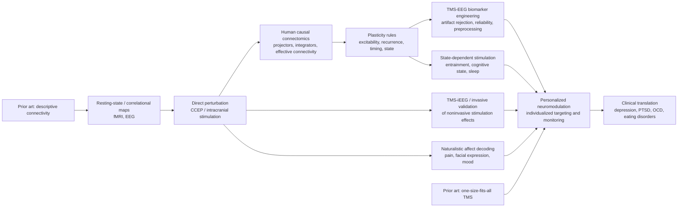

# Precision Neurotherapeutics Lab — concept diagram

```mermaid
flowchart LR
    A[Resting-state / correlational maps\nfMRI, EEG] --> B[Direct perturbation\nCCEP / intracranial stimulation]
    B --> C[Human causal connectomics\nprojectors, integrators, effective connectivity]
    C --> D[Plasticity rules\nexcitability, recurrence, timing, state]
    D --> E[TMS-EEG biomarker engineering\nartifact rejection, reliability, preprocessing]
    B --> F[TMS-iEEG / invasive validation\nof noninvasive stimulation effects]
    E --> G[Personalized neuromodulation\nindividualized targeting and monitoring]
    F --> G
    D --> H[State-dependent stimulation\nentrainment, cognitive state, sleep]
    H --> G
    G --> I[Clinical translation\ndepression, PTSD, OCD, eating disorders]
    B --> J[Naturalistic affect decoding\npain, facial expression, mood]
    J --> G

    K[Prior art: descriptive connectivity] --> A
    L[Prior art: one-size-fits-all TMS] --> G
```
